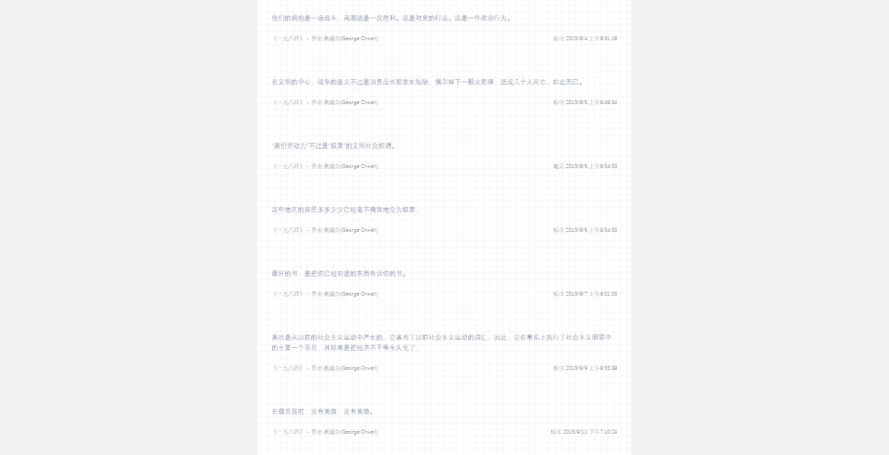

## 关于
kindle 一直是最近几年地铁上的好伙伴，多么嘈杂的时光，看着看着都能安静下来。最近将剪贴板的内容用脚本整理一下，再以电子的形式发布，也算是一种呼应吧。

## 用法
``` shell
node chew.js [path to your clippings file] [path to output chewed json]
```
若第二个 `path` 省略，默认输出在原剪贴板文件所在文件夹，文件名为 `chewed.json`

## 输出格式
``` JSON
[
  {
    "title": "追寻逝去的时光",
    "author": "周克希",
    "type": "标注", // "标注" || "笔记"
    "markDay": "2017/1/27",
    "markTime": "下午2:17:24",
    "sentence": "一般的听众和观众，只有在一种已经被他们慢慢领会的艺术的程式化作品中，才能感受到妩媚和优雅，领略到大自然的种种形态，而一个富有独创性的艺术家却正是从屏弃这些程式化的作品开始他的创作的"
  }
]
```

然后就可以用这 `json` 文件[随意渲染](https://xdudu.github.io/chew-your-kindle/)啦。

